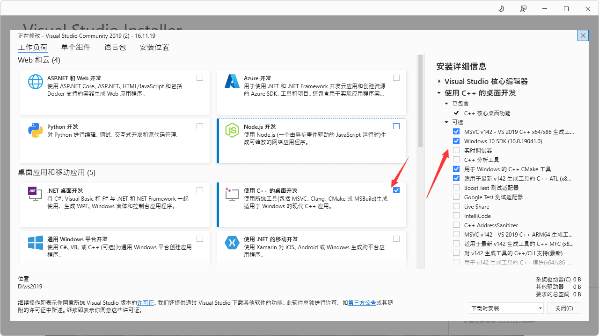

# Genshin-VitsWeb


## Feature

快速调用 Vits ;在 Web 生成语音

## 部署指南

| 软件名      | 下载链接    |
| ----------- | ----------- |
| Git         | [点我下载](https://ghproxy.com/github.com/git-for-windows/git/releases/download/v2.37.3.windows.1/Git-2.37.3-64-bit.exe)       |
| Miniconda   | [点我下载](https://repo.anaconda.com/miniconda/Miniconda3-latest-Windows-x86_64.exe)        |
如果你是小白 并且以上提及的几款软件你全都没装 [请看这里](install.md)

### Step 1 创建环境并克隆本仓库
---
```
conda create -n Genshin-Vits python=3.8 -y
conda activate Genshin-Vits
git clone https://github.com/HuanLinMaster/Genshin-VitsWeb
cd Genshin-VitsWeb
```

### Step 2 安装 Nodejs
---
```
conda install -c conda-forge nodejs
```

### Step 3 克隆 Vits 仓库并下载数据集
---
##### 注: Vits 仓库是要在本项目目录下克隆的！！
```
git clone --depth=1 https://github.com/Stardust-minus/vits
```
慢的话换成这个
```
git clone --depth=1 http://ghproxy.com/https://github.com/Stardust-minus/vits
```
或者这个
```
git clone --depth=1 http://gitclone.com/github.com/Stardust-minus/vits
```
自行下载 [数据集](https://obs.baimianxiao.cn/share/obs/sankagenkeshi/G_809000.pth) 并丢到vits目录内 ( ./vits )

### Step 4 安装 Vits 依赖及 Pytorch
--- 
去掉 ./vits/requirements.txt 中的 torchvision 那一行
```
Cython==0.29.21
librosa==0.8.0
matplotlib==3.3.1
numpy==1.18.5
phonemizer==2.2.1
scipy==1.5.2
tensorboard==2.3.0
# torchvision==0.7.0
Unidecode==1.1.1
pypinyin
pypinyin_dict
jieba
```

在 ./Vits 目录内执行
```
pip install -r requirements.txt -i http://mirrors.aliyun.com/pypi/simple/ --trusted-host mirrors.aliyun.com
```


分情况讨论
> 如果你的电脑没有显卡或者你不想要用显卡
> 
> 执行
> 
> (Mac/Windows)
> ```
> pip3 install torch torchvision torchaudio
> ```
> (Linux)
> ```
> pip3 install torch torchvision torchaudio --extra-index-url https://> download.pytorch.org/whl/cpu
>```

> 如果你的电脑有显卡 <br>
> [在这里选择自己的显卡型号，下载安装](https://www.nvidia.cn/Download/index.aspx?lang=cn#) <br>
> [在这里下载CUDNN,需要注册](https://developer.nvidia.com/rdp/cudnn-download) <br>
> 复制 cuDNN bin 目录下的文件到 CUDA 的 bin 目录下（.dll） <br>
> 复制 cuDNN include 目录下的文件到 CUDA 的 include 目录下（.h） <br>
> 复制 cuDNN lib/x64 目录下的文件到 CUDA 的 lib/x64 目录下（.lib） <br>
> 添加环境变量，把 C:\Program Files\NVIDIA GPU Computing > Toolkit\CUDA\v10.1\lib\x64 加到 path 中 <br>

然后两种情况都需要的

安装Visual Studio2019的下面这些

(MSVC安装v142版本的，截错图了)



重启电脑！！！一定要重启！！！

重启完了继续

进入 ./vits/monotonic_align/ 目录 执行
```
python setup.py build_ext --inplace
```
### Step 5 写入调用脚本
---
将下面的python文件写入 ./vits/gent.py (不存在 需自行创建) 内
```
    import imp
    import sys
    import matplotlib.pyplot as plt
    import numpy as np
    import scipy.io.wavfile as wav
    print("开始")
    import base64
    import os
    import json
    import math
    import torch
    from torch import nn
    from torch.nn import functional as F
    from torch.utils.data import DataLoader

    import commons
    import utils
    from data_utils import TextAudioLoader, TextAudioCollate, TextAudioSpeakerLoader, TextAudioSpeakerCollate
    from models import SynthesizerTrn
    from text.symbols import symbols
    from text import text_to_sequence

    from scipy.io.wavfile import write

    def get_text(text, hps):
        text_norm = text_to_sequence(text, hps.data.text_cleaners)
        if hps.data.add_blank:
            text_norm = commons.intersperse(text_norm, 0)
        text_norm = torch.LongTensor(text_norm)
        return text_norm
    hps_mt = utils.get_hparams_from_file("./configs/genshin.json")
    npcList = ['派蒙', '凯亚', '安柏', '丽莎', '琴', '香菱', '枫原万叶','迪卢克', '温迪', '可莉', '早柚', '托马', '芭芭拉', '优菈','云堇', '钟离', '魈', '凝光', '雷电将军', '北斗','甘雨', '七七', '刻晴', '神里绫华', '戴因斯雷布', '雷泽','神里绫人', '罗莎莉亚', '阿贝多', '八重神子', '宵宫','荒泷一斗', '九条裟罗', '夜兰', '珊瑚宫心海', '五郎','散兵', '女士', '达达利亚', '莫娜', '班尼特', '申鹤','行秋', '烟绯', '久岐忍', '辛焱', '砂糖', '胡桃', '重云','菲谢尔', '诺艾尔', '迪奥娜', '鹿野院平藏']
    device = ('cuda' if torch.cuda.is_available() else 'cpu')
    net_g_mt = SynthesizerTrn(
        len(symbols),
        hps_mt.data.filter_length // 2 + 1,
        hps_mt.train.segment_size // hps_mt.data.hop_length,
        n_speakers=hps_mt.data.n_speakers,
        **hps_mt.model).to(device)
    _ = net_g_mt.eval()

    _ = utils.load_checkpoint("./G_809000.pth", net_g_mt, None)

    speaker = sys.argv[1]
    t_mt=sys.argv[2]
    try:
        noise = float(sys.argv[3])
    except:
        noise = .667
    try:
        noisew = float(sys.argv[4])
    except:
        noisew = .8
    try:
        length = float(sys.argv[5])
    except:
        length = 1.2
    stn_tst_mt = get_text(t_mt.replace("\n", ""), hps_mt)

    with torch.no_grad():
        x_tst_mt = stn_tst_mt.to(device).unsqueeze(0)
        x_tst_mt_lengths = torch.LongTensor([stn_tst_mt.size(0)]).to(device)
        sid_mt = torch.LongTensor([npcList.index(speaker)]).to(device)
        audio_mt = net_g_mt.infer(x_tst_mt, x_tst_mt_lengths, sid=sid_mt, noise_scale=noise, noise_scale_w=noisew, length_scale=1.2)[0][0,0].data.cpu().float().numpy()
    wav.write("output.wav", hps_mt.data.sampling_rate, audio_mt)
    print("生成完毕")

```

### Step 6 开启服务端
---
回到项目目录
```
npm i --registry=https://registry.npmmirror.com/
node ./app.js
```
默认端口8881